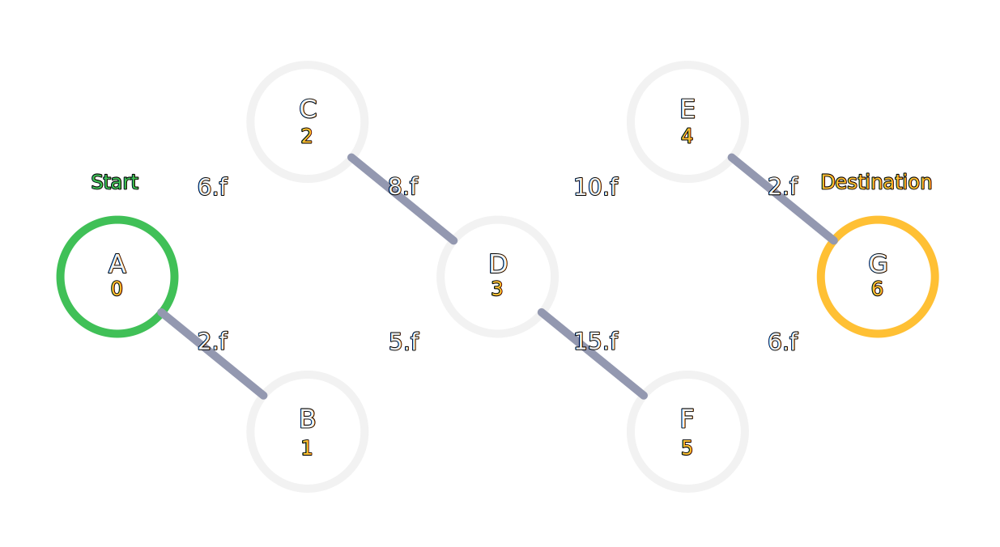

# rzn-dijkstra

Simple [Dijkstra's algorithm](https://en.wikipedia.org/wiki/Dijkstra%27s_algorithm) implementation in C++ with STL.
C++ 표준 라이브러리를 이용해 작성한 간단한 다익스트라 알고리즘 입니다.

## *example.cc*

Example graph structure is below:

Have fun!
